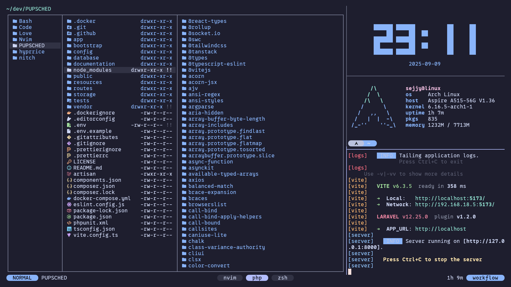
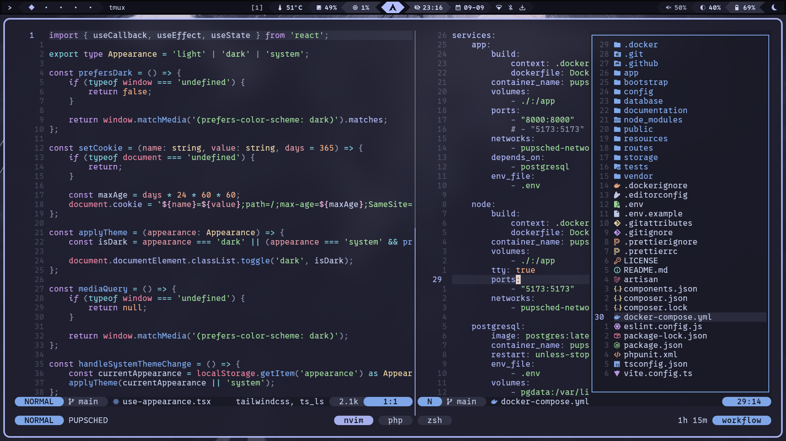

## 📂 .files

A simple Hyprland setup.

|  |
| :--------------------------------: |

|  |
| :--------------------------------: |

|  |
| :----------------------------: |

|  |
| :------------------------------: |

